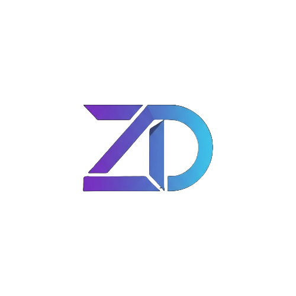

  

  

<h1 align="center">
  
</h1>

  
  
  

 

### 🌐 España • Full Stack Developer • Open Source Enthusiast

interface Developer {
  code: string[];
  expertise: string[];
  mindset: string;
}

const oliver: Developer = {
  code: ["Java", "JavaScript", "TypeScript", "PHP", "Dart", "Python"],
  expertise: ["Web Development", "Mobile Apps", "System Architecture"],
  mindset: "Forget the risk and take the fall"
};

 

---

 

<h2 align="center">⚡ Tech Arsenal</h2>

**Languages**

**Frontend & Design**

**Backend & Database**

**Tools & DevOps**

 

---

 

<h2 align="center">📊 GitHub Performance</h2>

  
  

 

  

 

---

 

<h2 align="center">🐍 Contribution Graph</h2>

  <picture>
    <source media="(prefers-color-scheme: dark)" srcset="https://raw.githubusercontent.com/ZiwiiDev/ZiwiiDev/output/snake-dark.svg">
    <source media="(prefers-color-scheme: light)" srcset="https://raw.githubusercontent.com/ZiwiiDev/ZiwiiDev/output/snake-light.svg">
    
  </picture>

 

---

 

### 💭 Philosophy

**"Keep it Simple"**

*Building elegant solutions, one commit at a time*

 

  

